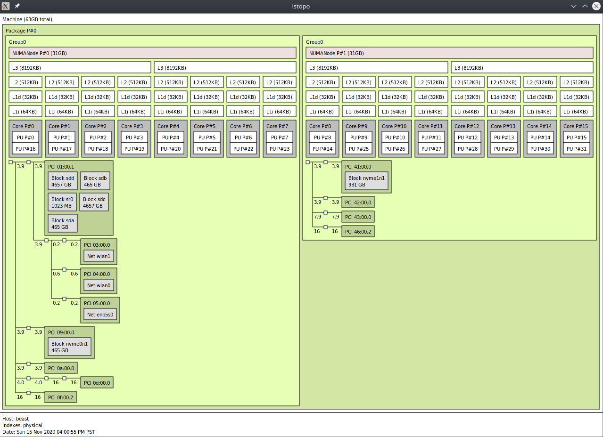

# TL&DR

* PCIE pass-through is lovely; who does not want Windows as an appliance; a Windows guest gremlin confined to a box where is can serve the only purpose Windows has every served; a life support system for games from the last 30 years.
* It is easy to incur overhead when you try to set up PCIE pass-through; you better enjoy tinkering, because you will be doing a lot of it
* libvirt enlightenments made a large difference to idle CPU usage consumption

# Introduction

I have been running a PCIE pass-through setup for the last couple years. I find the concept incredibly appealing; you can have one central seat of processing power in your abode and divvy up the cores/memory as per your hearts desire.

As mentioned elsewhere, there is a lot of trial and error encapsulated in this blog, as well as pieces/bits swiped from a multitude of sources; I don't claim to have arrived at this configuration from first principles, I just want to centrally collect the information required to reproduce my functional passthrough setup.

# Passing through devices

My /proc/cmdline looks like this:

```
initrd=\amd-ucode.img initrd=\initramfs-spudd-master.img root=PARTLABEL=NVMEROOT rw vfio-pci.ids=1002:66af,1002:ab20,144d:a808,1b73:1100,1d6a:d107 video=efifb:off amdgpu.dc=1 amd_iommu=on iommu=pt default_hugepagesz=2M hugepagesz=2M modeset pcie_aspm=off scsi_mod.use_blk_mq=1 cgroup_no_v1="all" init_on_alloc=1 init_on_free=0 transparent_hugepage=always rqshare=llc audit=0 threadirqs mitigations=off
```

of which:

vfio-pci.ids=1002:66af,1002:ab20,144d:a808,1b73:1100,1d6a:d107 reserves pci devices which Linux should _not_ initialize or touch (passthrough)
amd_iommu=on iommu=pt attempts to set sane default functionality

The kvm behavior needs to be customized to reflect that I am using a modern AMD host:

```
cat /etc/modprobe.d/kvm.conf 
options kvm ignore_msrs=1 report_ignored_msrs=0
options kvm_amd npt=1 nested=0 avic=1
```

I could be defining the pci addressed to bypass in the vfio configuration file, and indeed was until I opted for kernel cmdline parameters in the name of expedient iteration (who wants to repack initramfs)

```
cat /etc/modprobe.d/vfio.conf 
#options vfio-pci ids=1002:7300,1002:aae8
#options vfio-pci ids=1002:7300,1002:aae8,1022:1452,1022:1454,1022:145a,1022:1456,1022:145c,144d:a804
#options vfio-pci ids=1002:7300,1002:aae8,1022:145c,144d:a804
#options vfio-pci ids=1002:7300,1002:aae8,1022:145c
#options vfio-pci ids=1022:145c,144d:a804,1002:ab20,1002:66af
#options vfio-pci ids=1002:ab20,1002:66af,1022:145c
#options vfio-pci ids=1002:ab20,1002:66af,1022:145c,1022:1456,1022:145a,1022:1454,1022:1452
#options vfio-pci ids=1002:ab20,1002:67df
#options vfio-pci ids=1002:66af,1002:ab20,144d:a808
#options vfio_iommu_type1 allow_unsafe_interrupts=1
options vhost_net experimental_zcopytx=1
```

These addresses are derived from:

```
$ ~/io-mmu-groups 
IOMMU Group 0 00:01.0 Host bridge [0600]: Advanced Micro Devices, Inc. [AMD] Family 17h (Models 00h-1fh) PCIe Dummy Host Bridge [1022:1452]
IOMMU Group 10 00:08.0 Host bridge [0600]: Advanced Micro Devices, Inc. [AMD] Family 17h (Models 00h-1fh) PCIe Dummy Host Bridge [1022:1452]
IOMMU Group 11 00:08.1 PCI bridge [0604]: Advanced Micro Devices, Inc. [AMD] Family 17h (Models 00h-0fh) Internal PCIe GPP Bridge 0 to Bus B [1022:1454]
IOMMU Group 12 00:14.0 SMBus [0c05]: Advanced Micro Devices, Inc. [AMD] FCH SMBus Controller [1022:790b] (rev 59)
IOMMU Group 12 00:14.3 ISA bridge [0601]: Advanced Micro Devices, Inc. [AMD] FCH LPC Bridge [1022:790e] (rev 51)
IOMMU Group 13 00:18.0 Host bridge [0600]: Advanced Micro Devices, Inc. [AMD] Family 17h (Models 00h-0fh) Data Fabric: Device 18h; Function 0 [1022:1460]
IOMMU Group 13 00:18.1 Host bridge [0600]: Advanced Micro Devices, Inc. [AMD] Family 17h (Models 00h-0fh) Data Fabric: Device 18h; Function 1 [1022:1461]
IOMMU Group 13 00:18.2 Host bridge [0600]: Advanced Micro Devices, Inc. [AMD] Family 17h (Models 00h-0fh) Data Fabric: Device 18h; Function 2 [1022:1462]
IOMMU Group 13 00:18.3 Host bridge [0600]: Advanced Micro Devices, Inc. [AMD] Family 17h (Models 00h-0fh) Data Fabric: Device 18h; Function 3 [1022:1463]
IOMMU Group 13 00:18.4 Host bridge [0600]: Advanced Micro Devices, Inc. [AMD] Family 17h (Models 00h-0fh) Data Fabric: Device 18h; Function 4 [1022:1464]
IOMMU Group 13 00:18.5 Host bridge [0600]: Advanced Micro Devices, Inc. [AMD] Family 17h (Models 00h-0fh) Data Fabric: Device 18h; Function 5 [1022:1465]
IOMMU Group 13 00:18.6 Host bridge [0600]: Advanced Micro Devices, Inc. [AMD] Family 17h (Models 00h-0fh) Data Fabric: Device 18h; Function 6 [1022:1466]
IOMMU Group 13 00:18.7 Host bridge [0600]: Advanced Micro Devices, Inc. [AMD] Family 17h (Models 00h-0fh) Data Fabric: Device 18h; Function 7 [1022:1467]
IOMMU Group 14 00:19.0 Host bridge [0600]: Advanced Micro Devices, Inc. [AMD] Family 17h (Models 00h-0fh) Data Fabric: Device 18h; Function 0 [1022:1460]
IOMMU Group 14 00:19.1 Host bridge [0600]: Advanced Micro Devices, Inc. [AMD] Family 17h (Models 00h-0fh) Data Fabric: Device 18h; Function 1 [1022:1461]
IOMMU Group 14 00:19.2 Host bridge [0600]: Advanced Micro Devices, Inc. [AMD] Family 17h (Models 00h-0fh) Data Fabric: Device 18h; Function 2 [1022:1462]
IOMMU Group 14 00:19.3 Host bridge [0600]: Advanced Micro Devices, Inc. [AMD] Family 17h (Models 00h-0fh) Data Fabric: Device 18h; Function 3 [1022:1463]
IOMMU Group 14 00:19.4 Host bridge [0600]: Advanced Micro Devices, Inc. [AMD] Family 17h (Models 00h-0fh) Data Fabric: Device 18h; Function 4 [1022:1464]
IOMMU Group 14 00:19.5 Host bridge [0600]: Advanced Micro Devices, Inc. [AMD] Family 17h (Models 00h-0fh) Data Fabric: Device 18h; Function 5 [1022:1465]
IOMMU Group 14 00:19.6 Host bridge [0600]: Advanced Micro Devices, Inc. [AMD] Family 17h (Models 00h-0fh) Data Fabric: Device 18h; Function 6 [1022:1466]
IOMMU Group 14 00:19.7 Host bridge [0600]: Advanced Micro Devices, Inc. [AMD] Family 17h (Models 00h-0fh) Data Fabric: Device 18h; Function 7 [1022:1467]
IOMMU Group 15 01:00.0 USB controller [0c03]: Advanced Micro Devices, Inc. [AMD] X399 Series Chipset USB 3.1 xHCI Controller [1022:43ba] (rev 02)
IOMMU Group 15 01:00.1 SATA controller [0106]: Advanced Micro Devices, Inc. [AMD] X399 Series Chipset SATA Controller [1022:43b6] (rev 02)
IOMMU Group 15 01:00.2 PCI bridge [0604]: Advanced Micro Devices, Inc. [AMD] X399 Series Chipset PCIe Bridge [1022:43b1] (rev 02)
IOMMU Group 15 02:00.0 PCI bridge [0604]: Advanced Micro Devices, Inc. [AMD] 300 Series Chipset PCIe Port [1022:43b4] (rev 02)
IOMMU Group 15 02:01.0 PCI bridge [0604]: Advanced Micro Devices, Inc. [AMD] 300 Series Chipset PCIe Port [1022:43b4] (rev 02)
IOMMU Group 15 02:02.0 PCI bridge [0604]: Advanced Micro Devices, Inc. [AMD] 300 Series Chipset PCIe Port [1022:43b4] (rev 02)
IOMMU Group 15 02:03.0 PCI bridge [0604]: Advanced Micro Devices, Inc. [AMD] 300 Series Chipset PCIe Port [1022:43b4] (rev 02)
IOMMU Group 15 02:04.0 PCI bridge [0604]: Advanced Micro Devices, Inc. [AMD] 300 Series Chipset PCIe Port [1022:43b4] (rev 02)
IOMMU Group 15 02:09.0 PCI bridge [0604]: Advanced Micro Devices, Inc. [AMD] 300 Series Chipset PCIe Port [1022:43b4] (rev 02)
IOMMU Group 15 03:00.0 Network controller [0280]: Qualcomm Atheros QCA6174 802.11ac Wireless Network Adapter [168c:003e] (rev 32)
IOMMU Group 15 04:00.0 Network controller [0280]: Wilocity Ltd. Wil6200 802.11ad Wireless Network Adapter [1ae9:0310] (rev 02)
IOMMU Group 15 05:00.0 Ethernet controller [0200]: Intel Corporation I211 Gigabit Network Connection [8086:1539] (rev 03)
IOMMU Group 15 08:00.0 USB controller [0c03]: ASMedia Technology Inc. ASM2142 USB 3.1 Host Controller [1b21:2142]
IOMMU Group 16 09:00.0 Non-Volatile memory controller [0108]: Samsung Electronics Co Ltd NVMe SSD Controller SM981/PM981/PM983 [144d:a808]
IOMMU Group 17 0a:00.0 Ethernet controller [0200]: Aquantia Corp. AQC107 NBase-T/IEEE 802.3bz Ethernet Controller [AQtion] [1d6a:d107] (rev 02)
IOMMU Group 18 0b:00.0 PCI bridge [0604]: Advanced Micro Devices, Inc. [AMD/ATI] Device [1002:14a0] (rev c1)
IOMMU Group 19 0c:00.0 PCI bridge [0604]: Advanced Micro Devices, Inc. [AMD/ATI] Device [1002:14a1]
IOMMU Group 1 00:01.1 PCI bridge [0604]: Advanced Micro Devices, Inc. [AMD] Family 17h (Models 00h-0fh) PCIe GPP Bridge [1022:1453]
IOMMU Group 20 0d:00.0 VGA compatible controller [0300]: Advanced Micro Devices, Inc. [AMD/ATI] Vega 20 [Radeon VII] [1002:66af] (rev c1)
IOMMU Group 21 0d:00.1 Audio device [0403]: Advanced Micro Devices, Inc. [AMD/ATI] Vega 20 HDMI Audio [Radeon VII] [1002:ab20]
IOMMU Group 22 0e:00.0 Non-Essential Instrumentation [1300]: Advanced Micro Devices, Inc. [AMD] Zeppelin/Raven/Raven2 PCIe Dummy Function [1022:145a]
IOMMU Group 23 0e:00.2 Encryption controller [1080]: Advanced Micro Devices, Inc. [AMD] Family 17h (Models 00h-0fh) Platform Security Processor [1022:1456]
IOMMU Group 24 0e:00.3 USB controller [0c03]: Advanced Micro Devices, Inc. [AMD] Family 17h (Models 00h-0fh) USB 3.0 Host Controller [1022:145c]
IOMMU Group 25 0f:00.0 Non-Essential Instrumentation [1300]: Advanced Micro Devices, Inc. [AMD] Zeppelin/Renoir PCIe Dummy Function [1022:1455]
IOMMU Group 26 0f:00.2 SATA controller [0106]: Advanced Micro Devices, Inc. [AMD] FCH SATA Controller [AHCI mode] [1022:7901] (rev 51)
IOMMU Group 27 0f:00.3 Audio device [0403]: Advanced Micro Devices, Inc. [AMD] Family 17h (Models 00h-0fh) HD Audio Controller [1022:1457]
IOMMU Group 28 40:01.0 Host bridge [0600]: Advanced Micro Devices, Inc. [AMD] Family 17h (Models 00h-1fh) PCIe Dummy Host Bridge [1022:1452]
IOMMU Group 29 40:01.1 PCI bridge [0604]: Advanced Micro Devices, Inc. [AMD] Family 17h (Models 00h-0fh) PCIe GPP Bridge [1022:1453]
IOMMU Group 2 00:01.2 PCI bridge [0604]: Advanced Micro Devices, Inc. [AMD] Family 17h (Models 00h-0fh) PCIe GPP Bridge [1022:1453]
IOMMU Group 30 40:01.2 PCI bridge [0604]: Advanced Micro Devices, Inc. [AMD] Family 17h (Models 00h-0fh) PCIe GPP Bridge [1022:1453]
IOMMU Group 31 40:01.3 PCI bridge [0604]: Advanced Micro Devices, Inc. [AMD] Family 17h (Models 00h-0fh) PCIe GPP Bridge [1022:1453]
IOMMU Group 32 40:02.0 Host bridge [0600]: Advanced Micro Devices, Inc. [AMD] Family 17h (Models 00h-1fh) PCIe Dummy Host Bridge [1022:1452]
IOMMU Group 33 40:03.0 Host bridge [0600]: Advanced Micro Devices, Inc. [AMD] Family 17h (Models 00h-1fh) PCIe Dummy Host Bridge [1022:1452]
IOMMU Group 34 40:03.1 PCI bridge [0604]: Advanced Micro Devices, Inc. [AMD] Family 17h (Models 00h-0fh) PCIe GPP Bridge [1022:1453]
IOMMU Group 35 40:04.0 Host bridge [0600]: Advanced Micro Devices, Inc. [AMD] Family 17h (Models 00h-1fh) PCIe Dummy Host Bridge [1022:1452]
IOMMU Group 36 40:07.0 Host bridge [0600]: Advanced Micro Devices, Inc. [AMD] Family 17h (Models 00h-1fh) PCIe Dummy Host Bridge [1022:1452]
IOMMU Group 37 40:07.1 PCI bridge [0604]: Advanced Micro Devices, Inc. [AMD] Family 17h (Models 00h-0fh) Internal PCIe GPP Bridge 0 to Bus B [1022:1454]
IOMMU Group 38 40:08.0 Host bridge [0600]: Advanced Micro Devices, Inc. [AMD] Family 17h (Models 00h-1fh) PCIe Dummy Host Bridge [1022:1452]
IOMMU Group 39 40:08.1 PCI bridge [0604]: Advanced Micro Devices, Inc. [AMD] Family 17h (Models 00h-0fh) Internal PCIe GPP Bridge 0 to Bus B [1022:1454]
IOMMU Group 3 00:01.3 PCI bridge [0604]: Advanced Micro Devices, Inc. [AMD] Family 17h (Models 00h-0fh) PCIe GPP Bridge [1022:1453]
IOMMU Group 40 41:00.0 Non-Volatile memory controller [0108]: Samsung Electronics Co Ltd NVMe SSD Controller SM981/PM981/PM983 [144d:a808]
IOMMU Group 41 42:00.0 Non-Volatile memory controller [0108]: Samsung Electronics Co Ltd NVMe SSD Controller SM981/PM981/PM983 [144d:a808]
IOMMU Group 42 43:00.0 VGA compatible controller [0300]: Advanced Micro Devices, Inc. [AMD/ATI] Ellesmere [Radeon RX 470/480/570/570X/580/580X/590] [1002:67df] (rev ef)
IOMMU Group 42 43:00.1 Audio device [0403]: Advanced Micro Devices, Inc. [AMD/ATI] Ellesmere HDMI Audio [Radeon RX 470/480 / 570/580/590] [1002:aaf0]
IOMMU Group 43 44:00.0 USB controller [0c03]: Fresco Logic FL1100 USB 3.0 Host Controller [1b73:1100] (rev 10)
IOMMU Group 44 45:00.0 Non-Essential Instrumentation [1300]: Advanced Micro Devices, Inc. [AMD] Zeppelin/Raven/Raven2 PCIe Dummy Function [1022:145a]
IOMMU Group 45 45:00.2 Encryption controller [1080]: Advanced Micro Devices, Inc. [AMD] Family 17h (Models 00h-0fh) Platform Security Processor [1022:1456]
IOMMU Group 46 45:00.3 USB controller [0c03]: Advanced Micro Devices, Inc. [AMD] Family 17h (Models 00h-0fh) USB 3.0 Host Controller [1022:145c]
IOMMU Group 47 46:00.0 Non-Essential Instrumentation [1300]: Advanced Micro Devices, Inc. [AMD] Zeppelin/Renoir PCIe Dummy Function [1022:1455]
IOMMU Group 48 46:00.2 SATA controller [0106]: Advanced Micro Devices, Inc. [AMD] FCH SATA Controller [AHCI mode] [1022:7901] (rev 51)
IOMMU Group 4 00:02.0 Host bridge [0600]: Advanced Micro Devices, Inc. [AMD] Family 17h (Models 00h-1fh) PCIe Dummy Host Bridge [1022:1452]
IOMMU Group 5 00:03.0 Host bridge [0600]: Advanced Micro Devices, Inc. [AMD] Family 17h (Models 00h-1fh) PCIe Dummy Host Bridge [1022:1452]
IOMMU Group 6 00:03.1 PCI bridge [0604]: Advanced Micro Devices, Inc. [AMD] Family 17h (Models 00h-0fh) PCIe GPP Bridge [1022:1453]
IOMMU Group 7 00:04.0 Host bridge [0600]: Advanced Micro Devices, Inc. [AMD] Family 17h (Models 00h-1fh) PCIe Dummy Host Bridge [1022:1452]
IOMMU Group 8 00:07.0 Host bridge [0600]: Advanced Micro Devices, Inc. [AMD] Family 17h (Models 00h-1fh) PCIe Dummy Host Bridge [1022:1452]
IOMMU Group 9 00:07.1 PCI bridge [0604]: Advanced Micro Devices, Inc. [AMD] Family 17h (Models 00h-0fh) Internal PCIe GPP Bridge 0 to Bus B [1022:1454]
```

where io-mmcu-groups was swiped from somewhere, and looks like this:

```
cat ~/io-mmu-groups 
#!/bin/bash
shopt -s nullglob
for d in /sys/kernel/iommu_groups/*/devices/*; do 
    n=${d#*/iommu_groups/*}; n=${n%%/*}
    printf 'IOMMU Group %s ' "$n"
    lspci -nns "${d##*/}"
done;
```

I am using a quad channel setup with my threadripper, which means my machines physical topology looks like this via (lstopo -p):



# Performance considerations

Let me preface this by stating that I probably harbour a lot of misinformation as to what makes or breaks PCIE 

* I ignored enlightenments for too long going through and enabling just about all of [https://github.com/kubevirt/kubevirt/issues/1919] really helped
* My clock configuration was initially such that my machine burned 60% of a core when Windows was entirely idle (steam closed); enlightments + hyperv clocking considerations had a marked impact on the idle behavior of my Windows client and baseline CPU load


# Final libvirt configuration file

My configuration file changed heavily over the period I had it; I would recommend checking it into git and tracking changes religiously there.
Here is my current libvirt configuration for my Windows box; virsh dumpxml --inactive CompromisedBeast

```
<domain type='kvm' xmlns:qemu='http://libvirt.org/schemas/domain/qemu/1.0'>
  <name>CompromisedBeast</name>
  <uuid>ffd4dcda-1987-409f-bd4c-5062821b7099</uuid>
  <memory unit='KiB'>16777216</memory>
  <currentMemory unit='KiB'>16777216</currentMemory>
  <vcpu placement='static' cpuset='4-7,20-23'>8</vcpu>
  <cputune>
    <vcpupin vcpu='0' cpuset='4'/>
    <vcpupin vcpu='1' cpuset='20'/>
    <vcpupin vcpu='2' cpuset='5'/>
    <vcpupin vcpu='3' cpuset='21'/>
    <vcpupin vcpu='4' cpuset='6'/>
    <vcpupin vcpu='5' cpuset='22'/>
    <vcpupin vcpu='6' cpuset='7'/>
    <vcpupin vcpu='7' cpuset='23'/>
  </cputune>
  <numatune>
    <memory mode='preferred' nodeset='0'/>
  </numatune>
  <resource>
    <partition>/machine</partition>
  </resource>
  <os>
    <type arch='x86_64' machine='pc-q35-4.1'>hvm</type>
    <loader readonly='yes' type='pflash'>/usr/share/edk2-ovmf/x64/OVMF_CODE.fd</loader>
    <nvram>/usr/share/ovmf/x64/compromisedbeast.fd</nvram>
    <boot dev='hd'/>
  </os>
  <features>
    <acpi/>
    <hyperv>
      <relaxed state='on'/>
      <vapic state='on'/>
      <spinlocks state='on' retries='8191'/>
      <vpindex state='on'/>
      <synic state='on'/>
      <stimer state='on'/>
      <reset state='on'/>
      <vendor_id state='on' value='banana'/>
      <frequencies state='on'/>
      <reenlightenment state='on'/>
      <tlbflush state='on'/>
    </hyperv>
    <kvm>
      <hidden state='on'/>
    </kvm>
    <vmport state='off'/>
  </features>
  <cpu mode='host-passthrough' check='none' migratable='off'>
    <topology sockets='1' dies='1' cores='4' threads='2'/>
    <cache mode='passthrough'/>
    <feature policy='disable' name='svm'/>
    <feature policy='disable' name='x2apic'/>
    <feature policy='require' name='topoext'/>
    <feature policy='require' name='invtsc'/>
  </cpu>
  <clock offset='utc'>
    <timer name='pit' tickpolicy='discard'/>
    <timer name='hypervclock' present='yes'/>
    <timer name='hpet' present='no'/>
  </clock>
  <on_poweroff>destroy</on_poweroff>
  <on_reboot>restart</on_reboot>
  <on_crash>destroy</on_crash>
  <pm>
    <suspend-to-mem enabled='no'/>
    <suspend-to-disk enabled='no'/>
  </pm>
  <devices>
    <emulator>/usr/bin/qemu-system-x86_64</emulator>
    <controller type='sata' index='0'>
      <address type='pci' domain='0x0000' bus='0x00' slot='0x1f' function='0x2'/>
    </controller>
    <controller type='pci' index='0' model='pcie-root'/>
    <controller type='pci' index='1' model='pcie-root-port'>
      <model name='pcie-root-port'/>
      <target chassis='1' port='0x10'/>
      <address type='pci' domain='0x0000' bus='0x00' slot='0x02' function='0x0' multifunction='on'/>
    </controller>
    <controller type='pci' index='2' model='pcie-to-pci-bridge'>
      <model name='pcie-pci-bridge'/>
      <address type='pci' domain='0x0000' bus='0x01' slot='0x00' function='0x0'/>
    </controller>
    <controller type='pci' index='3' model='pcie-root-port'>
      <model name='pcie-root-port'/>
      <target chassis='3' port='0x11'/>
      <address type='pci' domain='0x0000' bus='0x00' slot='0x02' function='0x1'/>
    </controller>
    <controller type='pci' index='4' model='pcie-root-port'>
      <model name='pcie-root-port'/>
      <target chassis='4' port='0x12'/>
      <address type='pci' domain='0x0000' bus='0x00' slot='0x02' function='0x2'/>
    </controller>
    <controller type='pci' index='5' model='pcie-root-port'>
      <model name='pcie-root-port'/>
      <target chassis='5' port='0x13'/>
      <address type='pci' domain='0x0000' bus='0x00' slot='0x02' function='0x3'/>
    </controller>
    <controller type='pci' index='6' model='pcie-root-port'>
      <model name='pcie-root-port'/>
      <target chassis='6' port='0x14'/>
      <address type='pci' domain='0x0000' bus='0x00' slot='0x02' function='0x4'/>
    </controller>
    <controller type='pci' index='7' model='pcie-root-port'>
      <model name='pcie-root-port'/>
      <target chassis='7' port='0x15'/>
      <address type='pci' domain='0x0000' bus='0x00' slot='0x02' function='0x5'/>
    </controller>
    <controller type='pci' index='8' model='pcie-root-port'>
      <model name='pcie-root-port'/>
      <target chassis='8' port='0x8'/>
      <address type='pci' domain='0x0000' bus='0x00' slot='0x01' function='0x0' multifunction='on'/>
    </controller>
    <controller type='pci' index='9' model='pcie-root-port'>
      <model name='pcie-root-port'/>
      <target chassis='9' port='0x9'/>
      <address type='pci' domain='0x0000' bus='0x00' slot='0x01' function='0x1'/>
    </controller>
    <controller type='pci' index='10' model='pcie-root-port'>
      <model name='pcie-root-port'/>
      <target chassis='10' port='0xa'/>
      <address type='pci' domain='0x0000' bus='0x00' slot='0x01' function='0x2'/>
    </controller>
    <controller type='pci' index='11' model='pcie-root-port'>
      <model name='pcie-root-port'/>
      <target chassis='11' port='0xb'/>
      <address type='pci' domain='0x0000' bus='0x00' slot='0x01' function='0x3'/>
    </controller>
    <controller type='pci' index='12' model='pcie-root-port'>
      <model name='pcie-root-port'/>
      <target chassis='12' port='0xc'/>
      <address type='pci' domain='0x0000' bus='0x00' slot='0x01' function='0x4'/>
    </controller>
    <controller type='virtio-serial' index='0'>
      <address type='pci' domain='0x0000' bus='0x03' slot='0x00' function='0x0'/>
    </controller>
    <controller type='usb' index='0' model='ich9-ehci1'>
      <address type='pci' domain='0x0000' bus='0x00' slot='0x1d' function='0x7'/>
    </controller>
    <controller type='usb' index='0' model='ich9-uhci1'>
      <master startport='0'/>
      <address type='pci' domain='0x0000' bus='0x00' slot='0x1d' function='0x0' multifunction='on'/>
    </controller>
    <controller type='usb' index='0' model='ich9-uhci2'>
      <master startport='2'/>
      <address type='pci' domain='0x0000' bus='0x00' slot='0x1d' function='0x1'/>
    </controller>
    <controller type='usb' index='0' model='ich9-uhci3'>
      <master startport='4'/>
      <address type='pci' domain='0x0000' bus='0x00' slot='0x1d' function='0x2'/>
    </controller>
    <controller type='scsi' index='0' model='virtio-scsi'>
      <address type='pci' domain='0x0000' bus='0x09' slot='0x00' function='0x0'/>
    </controller>
    <interface type='direct'>
      <mac address='52:54:00:16:c8:02'/>
      <source dev='enp5s0' mode='bridge'/>
      <model type='virtio'/>
      <address type='pci' domain='0x0000' bus='0x0c' slot='0x00' function='0x0'/>
    </interface>
    <input type='mouse' bus='virtio'>
      <address type='pci' domain='0x0000' bus='0x0a' slot='0x00' function='0x0'/>
    </input>
    <input type='keyboard' bus='virtio'>
      <address type='pci' domain='0x0000' bus='0x0b' slot='0x00' function='0x0'/>
    </input>
    <input type='mouse' bus='ps2'/>
    <input type='keyboard' bus='ps2'/>
    <sound model='ich9'>
      <address type='pci' domain='0x0000' bus='0x00' slot='0x1b' function='0x0'/>
    </sound>
    <hostdev mode='subsystem' type='pci' managed='yes'>
      <driver name='vfio'/>
      <source>
        <address domain='0x0000' bus='0x0a' slot='0x00' function='0x0'/>
      </source>
      <address type='pci' domain='0x0000' bus='0x04' slot='0x00' function='0x0'/>
    </hostdev>
    <hostdev mode='subsystem' type='pci' managed='yes'>
      <driver name='vfio'/>
      <source>
        <address domain='0x0000' bus='0x0d' slot='0x00' function='0x0'/>
      </source>
      <address type='pci' domain='0x0000' bus='0x06' slot='0x00' function='0x0'/>
    </hostdev>
    <hostdev mode='subsystem' type='pci' managed='yes'>
      <driver name='vfio'/>
      <source>
        <address domain='0x0000' bus='0x0d' slot='0x00' function='0x1'/>
      </source>
      <address type='pci' domain='0x0000' bus='0x07' slot='0x00' function='0x0'/>
    </hostdev>
    <hostdev mode='subsystem' type='pci' managed='yes'>
      <driver name='vfio'/>
      <source>
        <address domain='0x0000' bus='0x44' slot='0x00' function='0x0'/>
      </source>
      <address type='pci' domain='0x0000' bus='0x05' slot='0x00' function='0x0'/>
    </hostdev>
    <hostdev mode='subsystem' type='pci' managed='yes'>
      <driver name='vfio'/>
      <source>
        <address domain='0x0000' bus='0x42' slot='0x00' function='0x0'/>
      </source>
      <address type='pci' domain='0x0000' bus='0x08' slot='0x00' function='0x0'/>
    </hostdev>
    <memballoon model='none'/>
  </devices>
  <seclabel type='dynamic' model='dac' relabel='yes'/>
  <qemu:commandline>
    <qemu:arg value='-object'/>
    <qemu:arg value='input-linux,id=mouse1,evdev=/dev/input/by-id/usb-Logitech_USB_Receiver-if02-event-mouse'/>
    <qemu:arg value='-object'/>
    <qemu:arg value='input-linux,id=kbd1,evdev=/dev/input/by-id/usb-Metadot_-_Das_Keyboard_Das_Keyboard_Model_S-event-kbd,grab_all=on,repeat=on'/>
    <qemu:env name='QEMU_AUDIO_DRV' value='pa'/>
    <qemu:env name='QEMU_PA_SERVER' value='/run/user/60511/pulse/native'/>
  </qemu:commandline>
</domain>
```
